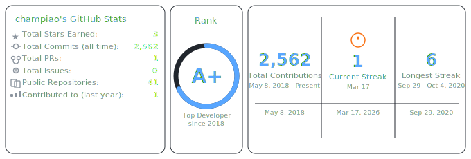
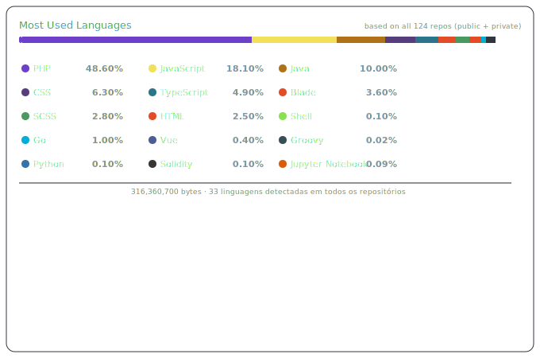

# Olá, eu sou o Champiao! 👋

  

  <em>🎯 Focused. Building things that matter.</em>

---

## 👨‍💻 Sobre mim

- 💻 Desenvolvedor com **8+ anos de experiência** (desde 2018), atuando do frontend à infraestrutura
- 🔭 Stack principal em **Go** para backends e APIs, **TypeScript/JavaScript** para frontends modernos
- 🌐 Ampla experiência com **PHP/Laravel** em projetos de grande porte, incluindo ERPs e plataformas financeiras
- ⛓️ Experiência com **Web3** — smart contracts em **Solidity** e integrações blockchain
- 🐳 Infraestrutura com **Docker**, CI/CD com **Jenkins**, automações em **Shell** e **Python**
- 🧠 Mais de **2.500 commits** em projetos públicos e privados
- 🌱 Sempre explorando novas tecnologias e construindo soluções reais

---

## 🚀 Tech Stack

### Linguagens

  
  
  
  
  
  
  

### Frontend

  
  
  
  
  

### Backend & Frameworks

  
  
  
  

### Banco de Dados & Infra

  
  
  
  
  
  

### Web3

  
  
  

---

## 📊 GitHub Stats

  

  

---

## 📌 Projetos Públicos em Destaque

| Projeto | Descrição | Stack |
|---|---|---|
| [🔗 go-native-selenium](https://github.com/champiao/go-native-selenium) | Implementação nativa do protocolo **W3C WebDriver** em Go puro — sem dependência do Selenium Java. Suporta waits explícitos, cookies, screenshots e ChromeDriver automático | Go |
| [📧 GomailAPI](https://github.com/champiao/GomailAPI) | API REST para disparo de e-mails com **múltiplas configs SMTP** por ENV — centraliza envios de múltiplos sistemas em uma única API | Go |
| [🔲 goQr](https://github.com/champiao/goQr) | Gerador de QR Code em Go | Go |
| [🗄️ mongoXpostgres](https://github.com/champiao/mongoXpostgres) | Comparativo prático entre MongoDB e PostgreSQL | Go |
| [🤖 domainBot](https://github.com/champiao/domainBot) | Bot **Telegram** que monitora expiração de domínios via variáveis de ambiente | Python |
| [🐳 docker](https://github.com/champiao/docker) | Script automatizado para instalação do Docker em Linux | Python |

---

## 🏆 Conquistas GitHub

  
  

---

## 🎓 Certificações

<b>☁️ AWS & Cloud (7 certificados)</b>

 

| Certificado | Plataforma | Data | Verificar |
|---|---|---|---|
| AWS S3 - Storage | Alura | Abr/2023 | [🔗](https://cursos.alura.com.br/certificate/cbf6f9bd-07b5-4d16-87c0-f82e5af5c610) |
| AWS EC2 | Alura | Abr/2023 | [🔗](https://cursos.alura.com.br/certificate/c983c87f-85fa-4e71-a499-6936ec9430e5) |
| AWS VPC | Alura | Abr/2023 | [🔗](https://cursos.alura.com.br/certificate/5dc884c3-5608-43a2-8108-ed455e571d6b) |
| AWS RDS & DynamoDB | Alura | Abr/2023 | [🔗](https://cursos.alura.com.br/certificate/231e43df-59b2-44eb-838b-37e333ad0b04) |
| AWS Lightsail | Alura | Abr/2023 | [🔗](https://cursos.alura.com.br/certificate/ba3a16b4-c1db-49d5-8208-12fab6982b3a) |
| Multi Cloud DevOps & AI | The Cloud Bootcamp | Out/2024 | [🔗](https://thecloudbootcamp.com/pt/verify/oythvtbltk) |
| AWS Cloud Bootcamp | Cloud Treinamentos | Jul/2021 | [🔗](https://www.cloudtreinamentos.com.br/certificate/RASSISCloud2) |
| AWS Discovery | KA Solutions | Jun/2021 | [🔗](https://www.kasolutions.com.br/certificate/KADISDAYRASS) |

<b>⚙️ DevOps & CI/CD (4 certificados)</b>

 

| Certificado | Plataforma | Data | Verificar |
|---|---|---|---|
| Kubernetes PODS, Services & ConfigMaps | Alura | Ago/2023 | [🔗](https://cursos.alura.com.br/certificate/98a6b584-4d7e-43ee-91a8-51d45d11105d) |
| Jenkins Continuous Integration | Alura | Abr/2023 | [🔗](https://cursos.alura.com.br/certificate/5d8d2e30-aec1-4375-8b5a-e5ec7e5ec8ab) |
| Jenkins & Docker Continuous Delivery | Alura | Abr/2023 | [🔗](https://cursos.alura.com.br/certificate/b6e368dd-2239-4b78-b419-fccd066a32aa) |
| GitHub Actions Continuous Integration | Alura | Abr/2023 | [🔗](https://cursos.alura.com.br/certificate/2cebf975-c823-4869-a371-952ad230c0d0) |

<b>🐘 PHP & Laravel (5 certificados)</b>

 

| Certificado | Plataforma | Data | Verificar |
|---|---|---|---|
| PHP Building Applications | Alura | Abr/2024 | [🔗](https://cursos.alura.com.br/certificate/eaf1829b-9c5f-4af7-a461-077120562c73) |
| PHP Skills Boost | Alura | Jun/2024 | [🔗](https://cursos.alura.com.br/certificate/d5451d0d-024b-4474-91b2-cfc33bda644c) |
| PHP Composer | Alura | Jun/2024 | [🔗](https://cursos.alura.com.br/certificate/5f30f014-1727-4885-b619-cc663e3b284a) |
| PHP OOP | Alura | Jun/2024 | [🔗](https://cursos.alura.com.br/certificate/a4339cbc-757e-4ab6-8d91-0e98b40cedf5) |
| Laravel Building MVC Applications | Alura | Jun/2024 | [🔗](https://cursos.alura.com.br/certificate/ae446d54-25c8-41aa-8672-01c4263f92cb) |

<b>🔵 Go (1 certificado)</b>

 

| Certificado | Plataforma | Data | Verificar |
|---|---|---|---|
| Go Exploring Google Language | Udemy | Dez/2024 | [🔗](https://www.udemy.com/certificate/UC-669206f4-98b2-42e9-bd9c-5b2c148df7c0) |

---

## 🌐 Conecte-se comigo

  
  
  

---

  <em>"Código bom é aquele que resolve o problema."</em>

